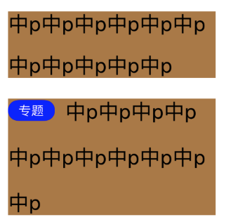

# M4String
## Meta
代码片段或不成熟的封装，能粗糙的解决特定问题，或展示一种思路

## Feature
- 为NSMutableAttributedString设置修正过的行间距（输入UI标注的行间距，添加适当修正过的行间距）
	- 可输出行高
	- 可输出是否超出限制行数（场景：Label限制最多显示2行，如果内容超过2行则显示“全文”按钮，类似朋友圈长文字下方的“全文”和收起）
- 为NSMutableAttributedString在段首添加标签，如下图，上面Label是添加前，下面Label是添加后
	- 
- 计算NSAttributedString的行高（不修正行间距，也没有其他操作，只是根据现状计算）
- 计算NSAttributedString的行数
- 
